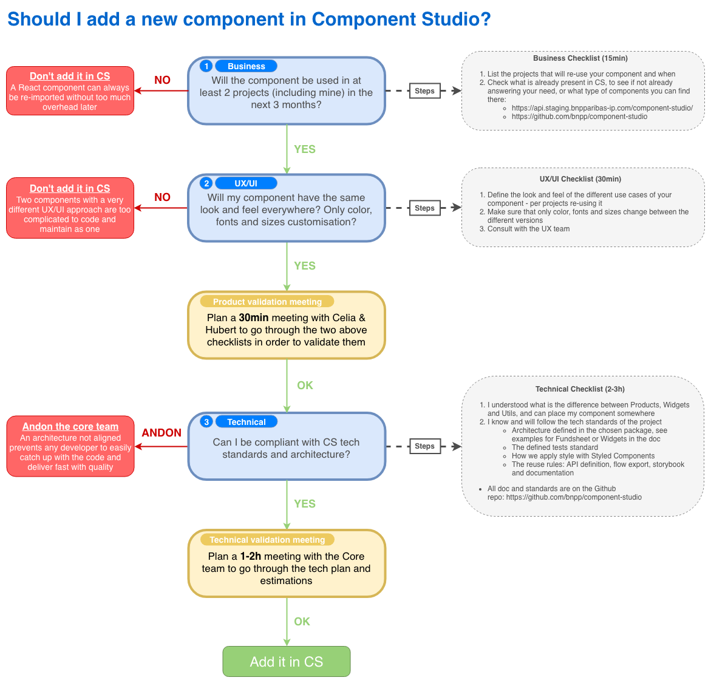
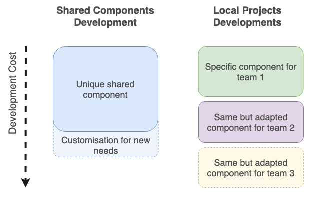

# Should I add a new component to SharedComponents?

> **The team currently responsible for SharedComponents:** Xavier Lefevre, Surya Ambrose and Ivan Poiraudeau

## How to decide?

> ⚠️ This process is to make sure that the cost of developing on SharedComponents is worth the gain

## Migration standards

Check there are no alternatives already existing in shared components for each component and subcomponent :

- In Storybook, try to find similar components in UI and Widgets sections
- Components might not be displayed in storybook, check directly in the code, if you see one without a story, contribute by creating its own story

Check that the style of every component and subcomponent verify the style standard : [Style standard](../technical-standards/architecture.md#how-to-style-your-components-in-shared-components)

When adding components using Redux for parent-child communication : [Component state standard](../technical-standards/architecture.md#how-to-handle-your-component-state-local-or-with-a-context)

## Development on SharedComponents is complex hence costly

Find below a comparison between developing a shared component on SharedComponents or a custom one directly in a project

1.  Digital Clubs and Galaxy will need a fundsheet in the coming weeks. These two fundsheets have equal design (except colors)
    - A single factorized fundsheet in SharedComponents is more complex to architect and develop than one directly in a project, but it allows for direct re-usability
    - Developing two fundsheets from scratch is slightly more costly but it allows for a full customisation
2.  A third project needs a fundsheet as well
    - Re-using the factorized fundsheet, adapting it slightly to make it more personalized will be less costly than a new full fundsheet
    - A greater cost of debt and dependencies maintenance + tests should be considered with Shared Components

> ⚠️ You can see the development flow cost [here](./legacy/development.md)
>
> 🎯 The full development process for developing **one ticket** until releasing it in production (like Digital Clubs) takes **~90min + a complex development**.
