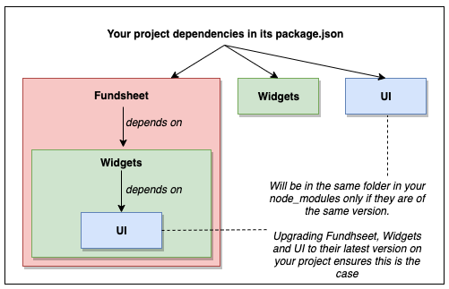

# Test local changes on your project, with `yarn link`

## 🚨 Prerequisite

### The issue

`yarn link` has known issues when linking packages whose peer dependencies require a single instance to be run on the host project (ex : `styled-components`)

Dependencies of linked packages are by default resolved from inside the SharedComponents monorepo, and doing so spawns another instance of them in addition to the ones your project may already be using.

### The solution

You need to tell your host project to always resolve these peer dependencies from inside your node_modules instead.

Add a [`resolve.alias`](https://webpack.js.org/configuration/resolve/#resolvealias) webpack config, such as this one (which should cover most peer dependencies of SharedComponents that are in this case):

```
// circumvent yarn link not being able to properly resolve peer dependencies of linked packages - https://github.com/shared-components/shared-components/blob/master/documentation/how-to-contribute/4.1-yarn-link.md#prerequisite

'styled-components': path.resolve(__dirname, 'node_modules/styled-components/')
'react': path.resolve(__dirname, 'node_modules/react/')
'react-dom': path.resolve(__dirname, 'node_modules/react-dom/')
```

_💡 Code example in a project that uses create-react-app_

You can find more details about the WHY of this solution [here](../for-the-core-team/why-using-aliases-for-yarn-link-is-better.md).

### `symlinks` option in webpack config

If [`resolve.symlinks`](https://webpack.js.org/configuration/resolve/#resolvesymlinks) is set to `false` in your webpack config, `yarn link` will probably fail.  
You can simply remove this option from your config since it defaults to `true`.

## Yarn Link Steps

1. Read the prerequisite above first
2. Determine in what case you are. Do you want to locally test the changes of let's say UI:
   1. **Normal case**: when UI is used directly on your project?
   2. ⚡ **Special case**: when UI is used for example through Widgets through Fundsheet on your project?
3. Install or upgrade to the latest version of the SharedComponents packages on your host project
   1. **Normal case**
      - **Command example**: `yarn upgrade @shared-components/atoms`
      - **Explanation**: If you plan on modifying a package, and testing it with `yarn link`, it's a good moment to test on your project potential breaking change from the latest version of the package.
   2. ⚡ **Special case**: ugrade all the packages from the chain (don't upgrade the packages not already in your dependencies though!)
      - **Command example**: `yarn upgrade @shared-components/product @shared-components/molecules @shared-components/atoms`
      - [**Explanation**](#-the-special-case-explanation-when-you-link-a-package-used-through-another-package)
4. Link the package on SharedComponents side
   - **Command example**: `cd packages/ui && yarn link`
5. Run the package in build watch mode
   - **Command example**: `yarn build:watch`
   - **Explanation**: You need a watcher to hot-rebuild the `bundle.development.js` file that your project will use
6. Link the package on your host project side
   - **Command example**: `cd <my-host-project> && yarn link @shared-components/atoms`
7. Start your host project

## ⚡ The special case explanation: when you link a package used through another package

Say you want to link UI, when UI is used by Widgets, itself used by Fundsheet on your project.

Per above, you'd need to:

```bash
yarn upgrade @shared-components/product @shared-components/molecules @shared-components/atoms # don't upgrade the packages not already in your dependencies though

cd packages/ui && yarn link # because UI is what you're modfiying
yarn build:watch

cd <my-host-project> && yarn link @shared-components/atoms
```

Why does it work?

- The lastest version of Fundsheet will always depends on the latest version of Widgets, which will also always depends on the latest version of UI. That's how Lerna updates package versions.
- In your project, yarn will place in the same folder (at the root of `node_modules/@shared-components`) the UI used by Widgets and the UI used by your host project if they are of the same version (same for Widgets)
- `yarn link @shared-components/atoms` will replace `node_modules/@shared-components/atoms` (ie the one at the root) by a symlink to the local UI package in SharedComponents.

<p align="center">
  
</p>

_([Source of the diagram](https://drive.google.com/open?id=1kT51cnJIuTwDppfOEeUg2JHhsjxgUoHH))_
