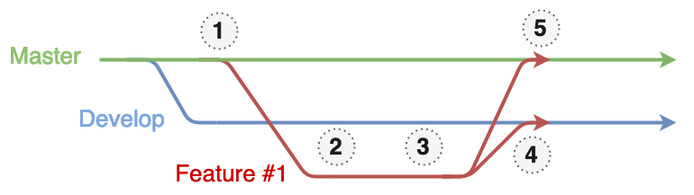

# SharedComponents Git flow: Share your contribution

## Commits syntax

The commit messages are used to generate changelogs, so the better they are, the easier our changelog can be understood by other developers :).

To create a new commit, use `yarn commit`

> As we use a git hook to enforce commit syntax, please avoid `git commit -m`.

This will prompt a tool to make your commits all clear, pretty and most importantly let you specify some breaking changes (see following section)

Steps are the following:

- **type of change** (feat, fix, style, refacto, ...): useful for automatic versionning (feat -> minor, fix -> patch, ...)
- **scope of change**: no standard yet, declare which component your modified for example
- **short description** of change
- **long description** (optional)
- **BREAKING CHANGES** (optional)
- **issues closed** (optional)
- **packages affected**: there are already preselected, just press 'Enter'

For more details, see this [document](https://www.notion.so/Publication-Automatique-b8802e8afceb47a78cce9a6438d84483).

## Breaking changes

A good, clear breaking-change commit message should answer the following question:

- how should I adapt my host project?

Thus, the commit message should contain:

- a short description of the changes that were made
- a list of changes that should be made in the project that consumes SharedComponents components so that it continues to function with the new major SharedComponents package version (unless it is not clear from the first point).

### Examples of clear commit messages:

- The return value of MediaHeaderButtons' modelizer has been changed. The previous return value is now under the 'documents' key of the current return value.
- HeaderTitle's theme API has changed, if you used it you need to replace color to fundNameColor and managementCompanyColor
- ShareSelectorModelizer becomes SelectorModelizer, and it takes one more prop which is the type ('shares' or 'currencies')

### Examples of unclear commit messages:

- Change return type of MarketingText modelizer. You do not have to change anything in your project if you do not directly use the modelizer
- Modify dashboard modelizer
- This might break some component design as the default theme implementation did not seem super robust so please be extremely careful when upgrading, check carefully your title and cards renderings

## Merging your code



Open a PR on master then on develop. You can use [Pretty Pull Request](./3-recommended-setup.md#pretty-pull-request) to do so.

1. Rebase your branch on master: `git fetch && git rebase origin/master`

   - **Why**: This way you know you are building on the latest master (and not on the old one that you started working with). Fix the conflicts if any.

2. Push your branch (`git push`) and open two PRs, one towards `master`, one towards `develop` (you can use [Pretty Pull Request](./3-recommended-setup.md#pretty-pull-request) to make it easier)
3. If changes are requested during the code review, preferably amend your commits with the changes

   - **Why**: This avoids little commits like `fix typo`, `fix variable naming` `fix tests` to appear in the final tree or in the Changelog. They bring very little value to the repo history.

4. Merge your PR into develop once approved, deploy it and wait for validation from your PO (see following section for more details about how to deploy)

   - If your feature is not validated and you need to amend your commit, please refer to the [next section](./5-share-your-contribution.md#how-to-amend-your-commit-if-your-feature-is-not-validated).

5. Merge your PR into master.

## Dealing with conflicts

### General tips

- Resolving conflicts alone is dangerous: go see the person you have conflicts with to avoid breaking / removing features.
- Conflicts in `package.json` / `yarn.lock`? Fix the conflicts in your `package.json`, then simply run `yarn`.
  Solving manually `yarn.lock` conflicts is NEVER A GOOD IDEA: a lockfile uses complex logic and it is virtually impossible to fix it manually.

### If there are conflicts between your branch and `develop`

**Do not use Github to fix your conflicts**, fix them locally:

- `git checkout develop`
- `git merge <your_branch>`
- Fix the conflicts and commit
- `git push`

> :warning::warning::warning: Never fix the conflicts by rebasing your branch on develop. Your branch must always stay above `master`, which is the only reliable reference.

### If there are conflicts between your branch and `master`:

- Rebase your branch on master
- Fix the conflicts
- Push force your branch
- Wait for the CI to run the tests to make sure everything is ok
- Merge **manually** your branch on develop, because the same conflicts will happen and the CI won't be able to handle them
  - `git checkout develop`
  - `git merge <your_branch>`
  - Fix the conflicts and commit
  - `git push`
- Merge your PR towards master

## How to amend your commit if your feature is not validated

- change your code
- **amend your commits**
- push-force your branch
- make a new PR towards develop and go back to (4). Once reviewed, you will probably need to merge manually your branch into develop because of conflicts.

This is for the same reason as above. In several months, someone might want to know what was the feature you were trying to develop and why. Knowing that you needed several trials to make it right won't matter. Having a single, meaningful commit containing working changes will.

## Storybook and SharedComponents packages publication

### Goal

With a single command on the HVD, you'll:

- Publish the latest dev or prod SharedComponents packages to Verdaccio
- Deploy Storybook dev or prod

### Steps

- Make sure the post-merge CI workflow develop or master has finished successfully
- Connect to a HVD
- Connect to the git server `ssh git`
- Go to the SharedComponents directory: `cd ~/shared-components` (:warning: not to the deployment kit folder like you may be used to)
- If you just merged your PR...
  - ...on **develop**: run `yarn deploy:uat`
  - ...on **master**: run `yarn deploy:prod`
- This will publish the packages AND deploy Storybook.
  You can then access the online Storybook at (trailing '/' is important):
  - **dev**: {your dev url}
  - **prod**: {your prod url}

On `develop` it releases `@dev` versions, on `master` it publishes normal versions following the **[Semantic Versioning standard](https://semver.org/)**
Learn [How you impact the versions that are published](https://www.notion.so/Publication-Automatique-b8802e8afceb47a78cce9a6438d84483))

### Add a development version of the package on your project

:warning: If you used `yarn link` on that package, please ensure you have unlink packages before you start : `yarn unlink @shared-components/<package-name>`

```bash
yarn add @shared-components/<package-name>@dev -E
```
