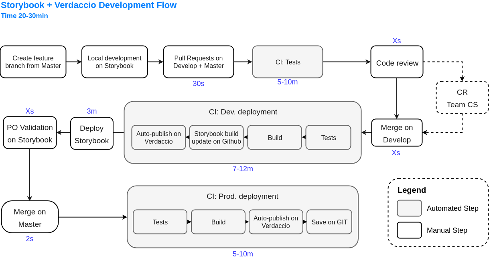

# Development

## Development Flow

> To update the documentation schemas find [the source here](tapas-schemas.xml) and modify with [draw.io](https://www.draw.io)

> Next step: automate changelog writing (See about using https://github.com/lerna/lerna#--conventional-commits and https://github.com/commitizen/cz-cli to automate changelogs with commit names)
