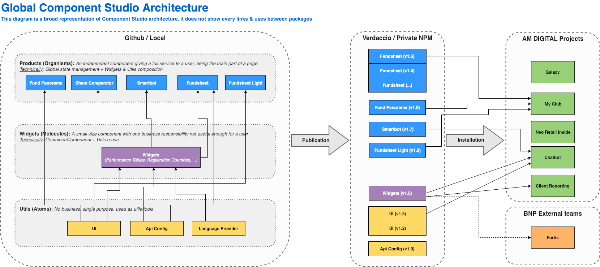

# [Standard] Architecture

## What does it mean?

By architecture we mean:

- the folders, files and code organisation
- the stored data organisation (e.g. Redux)
- the chosen vocabulary

## Why should I pay attention to my project architecture?

Our aim when architecturing is to:

- represent as best as possible the business domain in order for any developer to understand the business by reading the code
- make developers and domain experts communicate with the same language
- organise the project in a way that concerns and responsibilities are clearly defined, hence if a new feature is developed, the developer will easily find where to add it

A good architecture illustrated by a diagram is also an excellent way of explaining your project to people outside of the development team!

## What is a good architecture on Shared Components?

We have two levels of architecture:

- The global packages organisation
- The typical widgets and products internal architecture

The two below diagrams define the standard architecture for both levels on SharedComponents:

## What is the indicator to make sure this standard stays green?

| Packages                           | 30/10/2018                                                  | Last update KO reason                                                                                                                                                                                                                       |
| ---------------------------------- | ----------------------------------------------------------- | ------------------------------------------------------------------------------------------------------------------------------------------------------------------------------------------------------------------------------------------- |
| SharedComponents Generator:package |  KO | Doesn't export the Redux store by default                                                                                                                                                                                                   |
| API-Config                         |  OK |
| Entities                           |  KO | Doesn't match the latest architecture choice: having entities split by most related product. Example: fund data is mostly related to fundsheet hence a developer will naturaly get the Redux store for a fund through the fundsheet package |
| Fundsheet                          |  KO | Doesn't export the Redux store by default                                                                                                                                                                                                   |
| Fundsheet Light                    |  KO | We don't know what is the target architecture of this package                                                                                                                                                                               |
| Language Provider                  |  OK |
| Share Comparator                   |  KO | We don't know what is the target architecture of this package                                                                                                                                                                               |
| Smartbot                           |  KO | We don't know what is the target architecture of this package                                                                                                                                                                               |
| UI                                 |  KO | UI has Redux as a dependency                                                                                                                                                                                                                |
| Widgets                            |  OK |

### How to style your components in Shared Components

- Use [styled-components](https://www.styled-components.com/) and do not use classNames.

### How to handle your component state? Local or with a context?

If there are more than 5 subcomponents and more than 2 levels of depth :

- Add a Context Provider in the top level component to share its state
- Add a Context consumer in every subcomponent needing data from the top-level's state
- Replace all selectors with direct API calls

If there are less than 5 subcomponents or only 1 level of depth :

- Use callback function to share data between components
