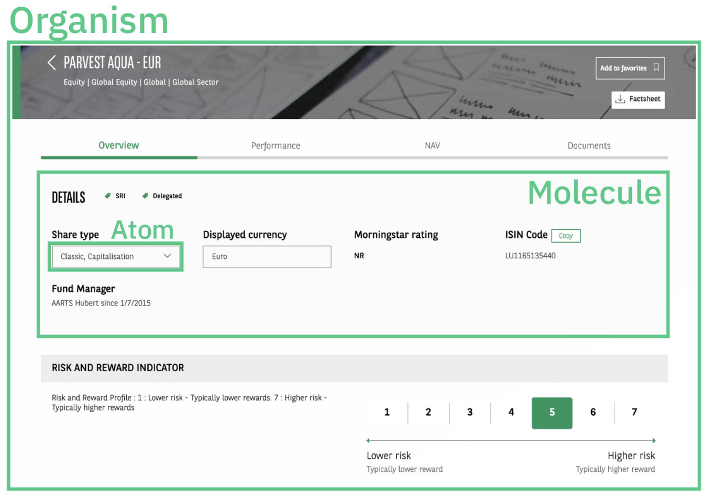
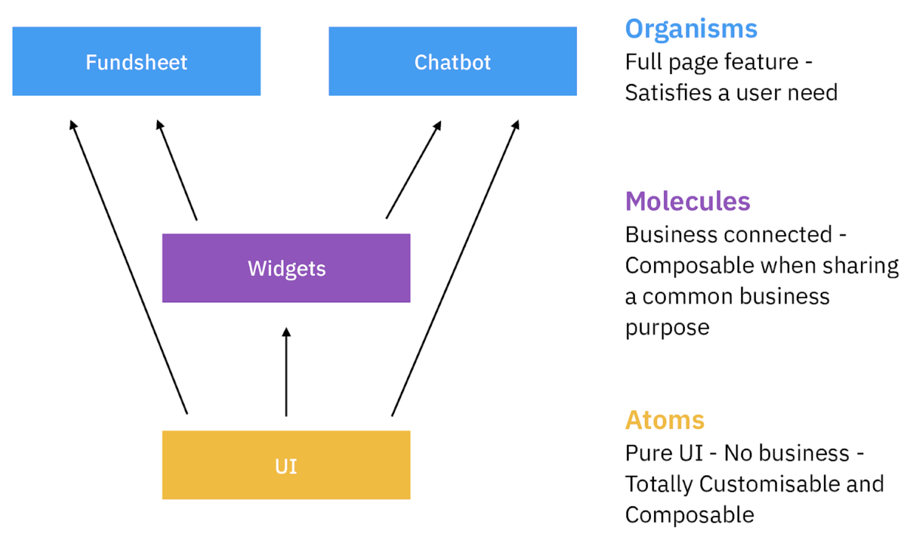

# Architecture

## What do we mean by architecture?

The organisation, communication, responsibilities and chosen vocabulary for the `packages > folders > files > code`.

## Why should I pay attention to my project architecture?

Our aim when architecturing is to:

- represent as best as possible the business domain in order for any developer to understand the business by reading the code
- make developers and domain experts communicate with the same language
- organise the project in a way that concerns and responsibilities are clearly defined, hence if a new feature is developed, the developer will easily find where to add it

An architecture illustrated by diagrams is also an excellent way of explaining your project to people outside of the development team!

## The chosen architecture

We followed [Brad Frost Atomic Design principles](http://bradfrost.com/blog/post/atomic-web-design/) to architecture the project.

> Find below two levels of zoom:

### **Large Zoom**: The global packages organisation

  <b>Example of components scope and how they fit together!</b>
   
  
   
   
  <b>Each rectangle is a package</b>
   
  

### **Closer Zoom**: Internals of typical packages and their APIs

  <b>The biggest rectangles represent a package in order to see their internals!</b>
   
  

