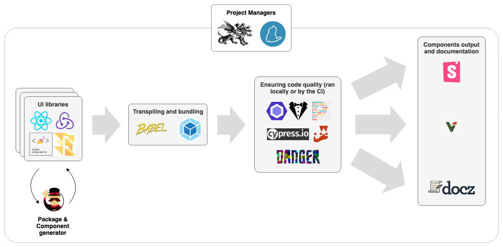
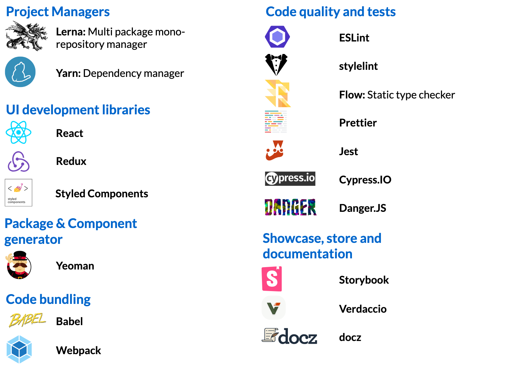

# ⚙ Shared React Components Example

## 🔍 Discover how we organised our project of shared React components!

If your objective is to share components of any size between several web applications, **you are in the right place**.

This repository hosts an example of a **mono-repository of shared React components, organised in different libraries**.

**Its aim is to**:
- Give you specific tips to make you accelerate
- Be a boilerplate: You can copy paste the repo entirely to reuse it as is

 

## Key learnings!

### **0. ⁉️ Should you develop such a project?**

From our experience, we proved in which condition it is valuable to share components between apps: [find out more with this article](https://medium.com/theodo/when-and-how-to-share-ui-components-between-apps-a44a44382de1).

### **1. 🧐 Use a mono-repository**

Split your responsibilities and domains in different packages, but have them all in one place for a smoother developer experience. We use [Lerna](https://github.com/lerna/lerna) for managing our mono-repo.

### **2. ⚛️ Follow "Atomic Design" principles**

An atom is a very small dumb and highly reusable component, while an organism is a full grown one-page business connected feature. It all comes from [Brad Frost Atomic Design principles](http://bradfrost.com/blog/post/atomic-web-design/). You can find diagrams of the project architecture [here](documentation/technical-standards/architecture.md).

### **3. 🎪 Display it all in one unique showroom: Storybook**

We use [Storybook](https://storybook.js.org/) to develop and showcase our components! One central and unbiased place, forcing any contributor to always think reusability. To try it, [install the project](documentation/how-to-contribute/2-getting-started.md) and run `yarn start`.

### **4. 🔨 Simplify your packages versioning and beware of breaking changes**

Use automatic versionning ([commitizen](http://commitizen.github.io/cz-cli/)), changelogs and type systems ([Flow](https://flow.org/) or [TypeScript](https://www.typescriptlang.org/)) to prevent messy bugs because of unanticipated breaking changes.

### **5. 🏭 Create new components/libraries with a "generator"**

Make sure that any new component follow the same design choices by using a "generator" like Yeoman.

### **6. 💄 Define your customisation strategy**

We used Styled Components themes and an additionnal service of ours to define how our components can be customised. [Find here more details](documentation/development/how-to-style-a-component.md).

### **7. 🌬 Make your packages light**

By building your packages as [ES6 modules](http://exploringjs.com/es6/ch_modules.html), your users will just bundle what they need. You can [find out how we did here](documentation/6-make-light-packages.md)

### **8. 👮‍ Control what components and features enter the repo**

Developing on "Shared components" is heavier than on a normal project, hence taking the decision to create a new component should be well thought. We recommend to plan at least 3 reuses of the component to make it worthwile. Here is [our decision tree](documentation/how-to-contribute/1-decision-making.md) to help us make that decision.

### **9. 🛣 Define a strict feature branch Git flow**

For us, all feature branches start from Master. PRs are first merged on Develop. Then on Master.
Regularly, we automatically merge Master in Develop to keep them aligned.

### **10. ♻️ Regularly update your dependencies**

More than any other project, "Shared components" has to be aligned with the latest standards, as new projects might launch and need to be compatible with it.

### **11. 👩‍💻👨‍💻 Dedicate a core team**

Just as an open source project, have a dedicated tech and business team focused on making "Shared components" a success. Without a core team, you won't have the focus and ownership necessary to handle such a project, hence the complexity and debt will accumulate and your developers will end up losing more time than winning, in the long run. We will be more specific in a dedicated article later on.

### **12. 🔗 Ease the Yarn Link pain**

If you want to locally test your component on your host project, you'll have to use "Yarn Link", we learned how [to deal with it](documentation/how-to-contribute/4.1-yarn-link.md).
 
 

## Locally start the project

If you want to launch Storybook locally, you follow the [installation steps here](documentation/how-to-contribute/2-getting-started.md)!
 
 

## The stack

 
 

## Roadmap

- [x] Finish the MVP: main readme + global article + basic Storybook running locally
- [x] Share online to see if it interests people
- [ ] Have an up and running project with working CI and hosted Storybook
- [ ] Deep dive on key learnings with further articles and project improvement
- [ ] Update of the repository basis to make it a boilerplate

## Contributors

|   [ <b>Aurélien Le Masson</b>](https://github.com/Ojisama)     | [ <b>Michel Parreno</b>](https://github.com/michel-p)  | [ <b>Hugo Lime</b>](https://github.com/HugoLime)  | [ <b>Justine Mignot</b>](https://github.com/justinemignot)  | [ <b>Surya Ambrose</b>](https://github.com/suryaambrose)  | [ <b>Ivan Poiraudeau</b>](https://github.com/ivanosevitch)  | [ <b>Xavier Lefèvre</b>](https://github.com/xavierlefevre)  |
| :------------------------------------------------------------------------------------------------------------------------------------------------------------------------: | :---------------------------------------------------------------------------------------------------------------------------------------------------------------: | :-----------------------------------------------------------------------------------------------------------------------------------------------------------: | :---------------------------------------------------------------------------------------------------------------------------------------------------------------------: | :------------------------------------------------------------------------------------------------------------------------------------------------------------------: | :---------------------------------------------------------------------------------------------------------------------------------------------------------------------: | :---------------------------------------------------------------------------------------------------------------------------------------------------------------------: |
| [ <b>Albéric Trancart</b>](https://github.com/AlbericTrancart)  | [ <b>Darya Talanina</b>](https://github.com/invfo)  |

## Powered by

| [ <b>Theodo</b> ](https://www.theodo.fr) |
| :--------------------------------------------------------------------------------------------------------: |

## License

Shared Components is [MIT licensed](LICENSE.md).
